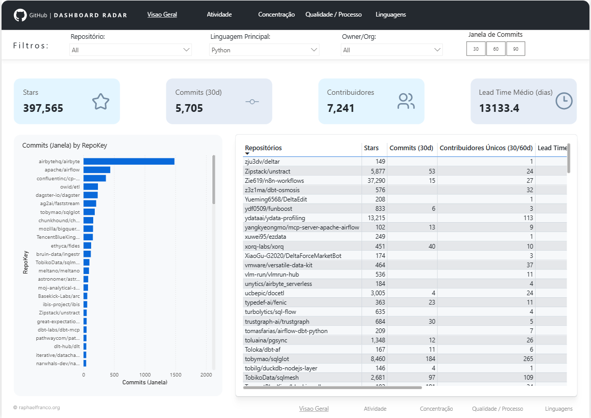
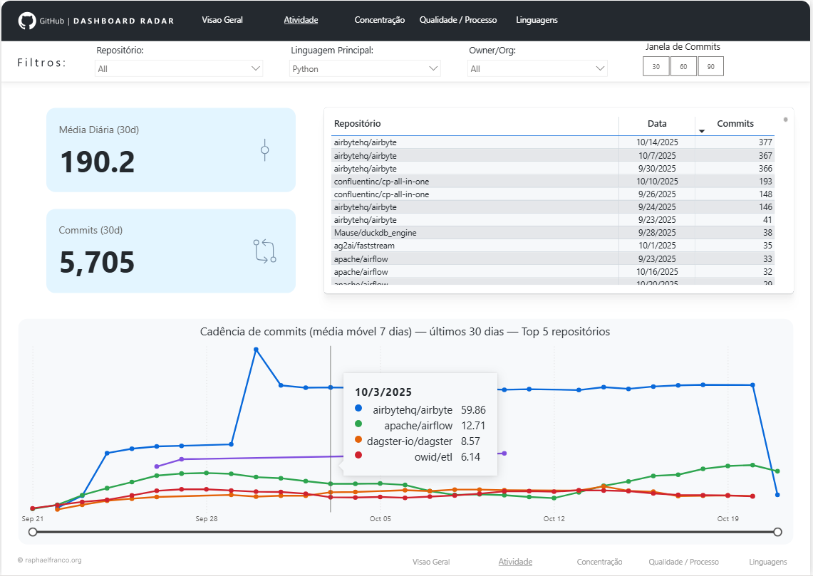
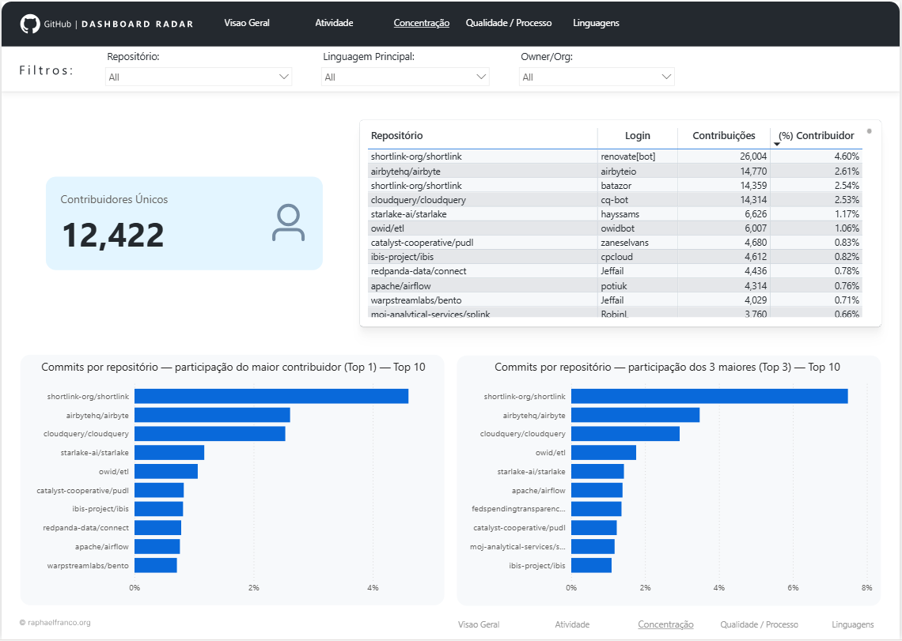
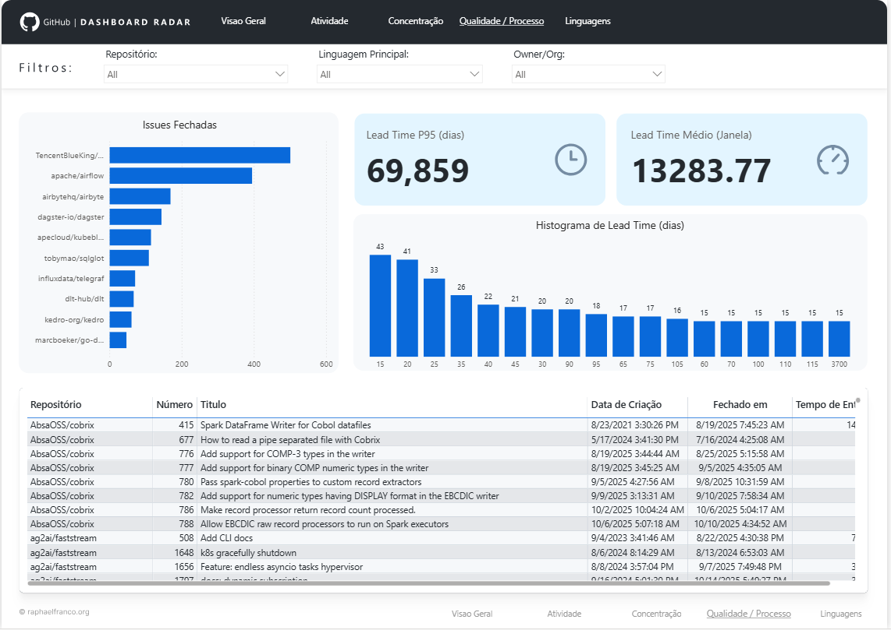
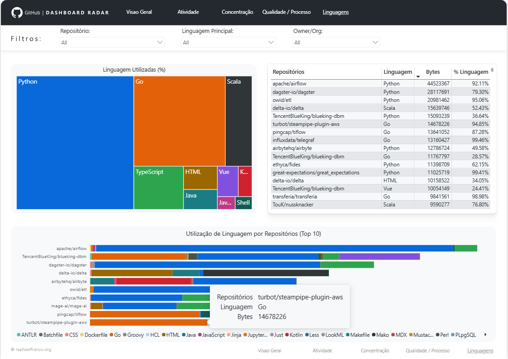
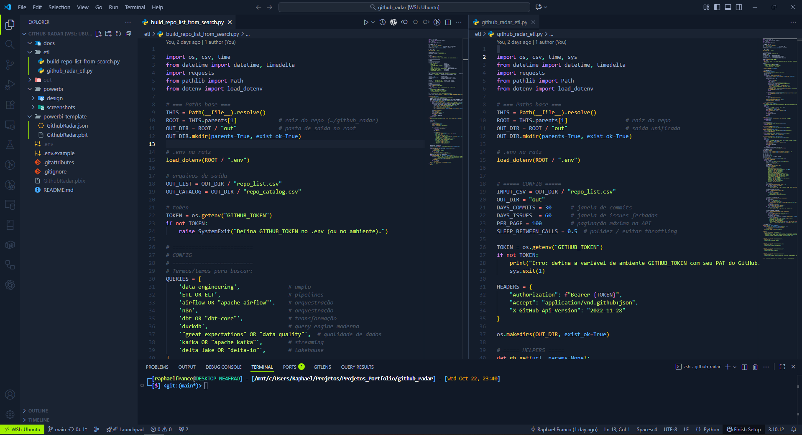

# GitHub Radar — Power BI (Data Engineering)

Dashboard analítico para inspeção de repositórios GitHub (atividade, concentração/“bus factor”, processo/qualidade e linguagens).
O projeto coleta dados via scripts Python (`etl/`), gera CSVs em `out/` e carrega tudo em um relatório Power BI (template `.pbit`).

---

## 🧭 Visão rápida
- **Stack**: Python (ETL) + Power BI
- **Dados**: API do GitHub → CSVs em `out/`
- **Relatório**: `powerbi_template/GithubRadar.pbit` (fonte oficial para versionamento)
- **Design**: arquivos **SVG** e **Figma** em `powerbi/design/`

---

## 📦 Estrutura do repositório
```
github_radar/
├─ etl/
│  ├─ build_repo_list_from_search.py     # busca e gera lista inicial de repositórios
│  └─ github_radar_etl.py                # coleta meta, linguagens, contribuidores, commits diários e issues fechadas
├─ out/                                  # SAÍDA dos CSVs (gerado pelo ETL; não versionar em produção)
│  ├─ repo_list.csv
│  ├─ repo_catalog.csv
│  ├─ repo_meta.csv
│  ├─ repo_languages.csv
│  ├─ repo_contributors.csv
│  ├─ repo_commits_daily.csv
│  └─ repo_issues_closed.csv
├─ powerbi/
│  ├─ design/                            # assets visuais do relatório
│  │  ├─ Visao Geral.svg
│  │  ├─ Atividade.svg
│  │  ├─ Concentração.svg
│  │  ├─ Processo.svg
│  │  └─ Linguagens.svg
│  └─ screenshots/                       # capturas usadas neste README
│     ├─ Screenshot_1.png
│     ├─ Screenshot_2.png
│     ├─ Screenshot_3.png
│     ├─ Screenshot_4.png
│     ├─ Screenshot_5.png
│     └─ Screenshot_6.png
├─ powerbi_template/
│  ├─ GithubRadar.pbit                   # TEMPLATE do relatório (versionado)
│  └─ GithubRadar.json                   # tema do relatório (importável no Power BI)
├─ .env.example                          # exemplo de variáveis de ambiente (GITHUB_TOKEN)
├─ GithubRadar.pbix                      # PBIX de release (opcional; preferir Releases do GitHub)
└─ README.md
```

> **Nota:** os caminhos acima refletem o estado atual do repo. Se mover pastas/arquivos, ajuste este README.

---

## 🚀 Como rodar (local)

### 1) Preparar ambiente
- Python 3.10+
- `pip install -r requirements.txt` (se houver; caso contrário: `pip install python-dotenv requests pandas`)
- Crie `.env` na **raiz** (ou edite o existente) a partir de `.env.example`:
  ```env
  GITHUB_TOKEN=SEU_TOKEN_DO_GITHUB
  ```

### 2) Executar o ETL
Na raiz do projeto:
```bash
python etl/build_repo_list_from_search.py
python etl/github_radar_etl.py
```
Saída esperada em `out//*.csv`.

### 3) Abrir o relatório
- Power BI Desktop → **File > Open** → `powerbi_template/GithubRadar.pbit`
- Informe o caminho da pasta `out/` quando solicitado (parâmetro)
- **Refresh** e navegue nas páginas

---

## 📊 Páginas do Dashboard

### 1) Visão Geral
- **KPIs**: Stars • Commits (janela) • Contribuidores Únicos • Lead Time (médio/mediano)
- **Tabela-hub**: ranking por atividade/concentração com link para o repo
- **Top 10 por atividade** (commits na janela)


### 2) Atividade
- Série temporal de commits (dia/semana) e **média móvel (MM7)**
- Slicers de repo/owner/language e janela de tempo


### 3) Concentração (Bus Factor)
- **Top1 Commits %** e **Top3 Commits %** por repositório
- Tabela “drill” por contribuidor (`login`, contribuições, % no repo)


### 4) Processo / Qualidade
- **Histograma** de `lead_time_days` (bins) e **P90/P95**
- Barras: Issues fechadas na janela por repo


### 5) Linguagens
- **Treemap** % por linguagem • Barra empilhada `linguagem × repo`


### 6) Layout/Design
- Paleta e tipografia do tema, grid e componentes


> Os arquivos vetoriais de cada página estão em `powerbi/design/*.svg` e o projeto Figma em `powerbi/design/GithubRadar_Design.fig`.

---

## 🧩 Medidas-chave (DAX) — highlights
- **Atividade**: `Commits (Janela)`, `Média Diária (30d)`
- **Concentração**: `Top1 Commits %`, `Top3 Commits %`, `Contribuidores Únicos`
- **Processo**: `Lead Time Mediano`, `Lead Time P95`, `Issues Fechadas (Janela)`
- **Linguagens**: `Bytes Linguagem`, `% Linguagem`

> O modelo segue estrela: `RepoMeta` (dim) → fatos (`RepoCommitsDaily`, `RepoContrib`, `RepoIssuesClosed`, `RepoLang`). Chave: `RepoKey = owner & "/" & repo`.

---

## 🔁 Fluxo de versionamento
- **Dia a dia**: editar `.pbix` localmente → **Exportar .pbit** → _commit_ do `.pbit`
- **Releases**: gerar `.pbix` final e publicar em **GitHub Releases** (ou versionar com **Git LFS** se necessário)
- `out/` permanece fora do Git (dados gerados)

---

## 🧪 Testes rápidos de sanidade
- `Rows Contrib (ctx)` varia por repo (filtro ok)
- `lead_time_days` numérico; histograma com bins sem `blank`
- `RepoMeta[RepoKey]` 1:* com fatos; URLs categorizadas como **Web URL**

---

## 📄 Licença & créditos
Use livremente para fins de estudo/portfólio. Cite **GitHub Radar – Power BI** quando aplicar.

---

## 📬 Contato
Dúvidas/sugestões: abra uma **Issue**.
